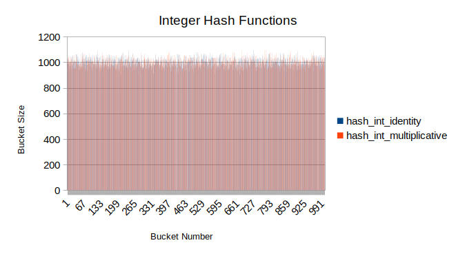
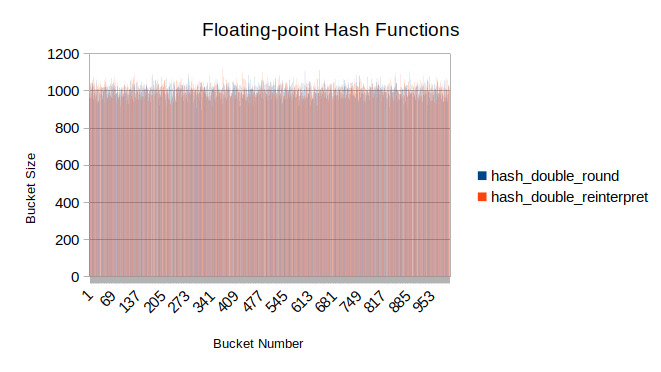
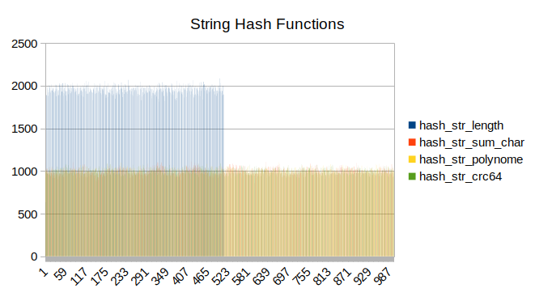
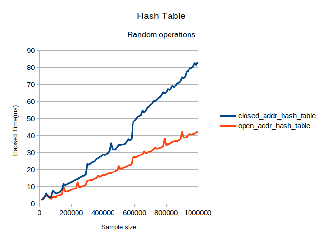
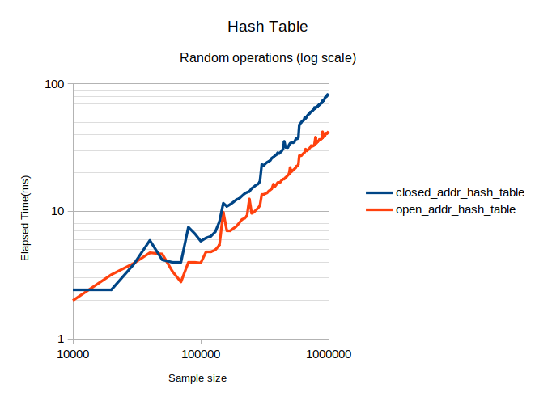
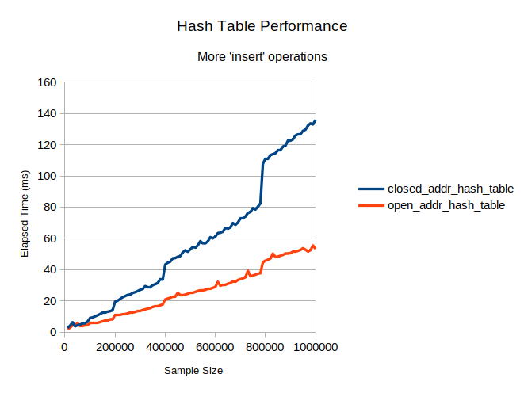
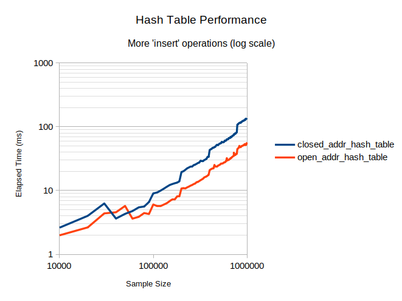

# Hash Table Research

## Introduction

This research focuses on performance of various implementations of hash table
and hash functions.

The following hash functions are considered:

- For integers:
  - Identity function
  - Multiplicative hash
- For floating-point numbers:
  - Round to nearest integer
  - Interpret IEEE-754 floating point number representation as unsigned integer
- For strings:
  - Length of string
  - Sum of characters
  - Polynomial hash
  - crc64 hash

The following hash table types are considered:

- Hash table with closed addressing (with linked list chaining)
- Hash table with open addressing

## Results

### **Hash functions**

Tests for various hash functions yielded the following results:

On uniformly-distributed inputs all functions behave similarly, except for
`hash_string_length` which is limited by maximum length of generated string.

However, `hash_string_sum_char` will behave poorly on larger table sizes, as
it will produce normal distribution of bucket sizes according to Central Limit
Theorem.

### **Hash tables**

When generating random queries for hash tables, the following results were
obtained:

On this data, hash table with open addressing performs about twice as fast as
with closed one.

When increasing the probability of insertion operation to 50%, the results were
following:

Now the hash table with open addressing is almost three times faster than
another implementation.

## Conclusions

### **Hash functions**

On uniform data nearly all function will behave efficiently, as the results show.
However, on a more structured data the results might change. For example, if the
range of input integers or floating-point numbers is smaller than the size of
hash table, the identity and round functions will behave inefficiently, similar
to the performance of `hash_str_length`.

`hash_str_sum_char` behaves efficiently on relatively small hash tables
containing long words, but it will inevitably suffer from the effects of
Central Limit Theorem in other cases.

### **Hash tables**

The hash table with open addressing performs much faster than the table with
closed addressing due to increased code locality and less frequent memory
allocations. This effect becomes more noticeable with larger sample sizes, as
spikes in execution time, indicating the occurrence of rehash, are higher for
the table with closed addressing. This indicates that the longer insertion times
are affecting the performance of a rehash, decreasing the overall hash table
performance even further. 
